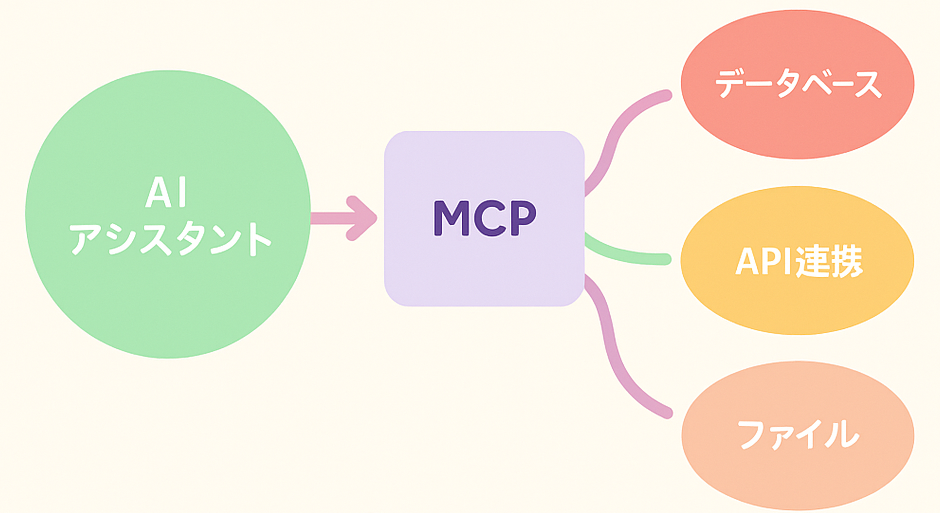

<style>
@import url('./styles.css');
</style>

<!-- _class: lead -->

# Cursor 活用法

---

## 1. イントロダクション

### 本日のゴール

-   **現状認識**: 基本的な Cursor の操作はできている前提で進める
-   **ゴール**: Cursor の仕組みを理解し、開発プロセスの中に積極的に活用できるようになる

> 💡 **Tips:**  
> Cursorの公式ガイド「[Working with Context](https://docs.cursor.com/guides/working-with-context)」を読むことで、より効果的な活用方法やコンテキストの扱い方を学べます。ぜひ一度目を通してみてください！

---

## 2. Cursor コア機能の再確認

- **Tab（自動補完）**  
  コードの文脈に応じて複数行を自動生成。コーディングスタイルや簡単なエラーも自動修正。

- **Cmd/Ctrl+K（インラインAI修正）**  
  選択範囲に対してピンポイントでAIに指示。リファクタ・コメント追加・テスト生成など。

- **Cmd/Ctrl+L（チャット/エージェント）**  
  コード全体や複数ファイルにまたがる質問・指示。エラー原因調査や自動修正、ターミナル操作も可能。

---

## 3. コンテキストの重要性

### なぜ質が重要か？

**AI の回答精度はコンテキストの質に依存**:

-   LLM は与えられた情報を基に回答を生成
-   コンテキストが不十分/不正確だと、推測や見当違いの回答になる

**適切な情報伝達で AI の能力を最大化**:

-   関連性の高いファイルや背景を正確に伝える
-   ゴミを入れればゴミが出てくる（GIGO 原則）

---

### コードインデックスの仕組み

**ローカルでのインデックス作成:**

-   Cursor はプロジェクトを開くと、コードベースの構造を解析
-   ファイル、関数、クラスなどのインデックスを作成
-   @シンボルでの参照やコードベース全体の質問が可能に

**参考ドキュメント:**

-   [コードベースインデックス](https://docs.cursor.com/context/codebase-indexing)
-   [ファイル除外設定](https://docs.cursor.com/context/ignore-files)

---

### AI が見ているもの(コンテキスト)を意識する

-   `@` で明示的に指定されたファイルやリンクやプロンプト
-   これまでのチャットのやりとり
-   User Rules
-   Project Rules(.cursorrules, .cursor/rules/)
-   現在アクティブなエディタタブ
-   開いているファイルの Linter Error
-   Agent モードでの自動で読み込むファイル

> 💡 **Tips**  
> 「あなたに送られているコンテキストを教えてください」とAIに尋ねることで、どの情報を元に回答しているかを確認できます。

---

### ナレッジのルール化＆ドキュメント化

**目的**:

-   チームの開発ルールとドキュメントを適切に管理
-   AI のコンテキストとして活用し、一貫性のある開発を促進

**メリット**:

-   チーム内ルールの遵守を自然に促進
-   レビューの手間削減
-   新規メンバーのオンボーディング効率化
-   ドキュメントに基づいた正確なコード生成/修正

---

### チームナレッジの管理方針

**外部サービス**:

-   API 仕様書など、外部サービスの最新仕様
-   `@Docs`で管理

**内部ルール**:

-   コーディング規約、設計標準、インフラ構成
-   `.cursor/rules`で管理

**追加方法**:

-   外部サービス: チャットで`@Docs`→Add new doc
-   内部ルール: `.cursor/rules`に直接記述

---

### 個人用 Notepad の活用

**目的**:

-   頻繁に使用するプロンプトの保存
-   特定タスクの指示を再利用可能に

**方法**:

-   Cursor の設定から Notepad オプションを有効化
-   @シンボルから参照可能

**Tips**:

-   よく使うプロンプトのテンプレート化
-   タスク固有のメモをまとめて保存
-   定期的な更新・整理で効率化

---

## 4. Cursor におけるワークフローの効率化

### エージェント駆動開発 ("Vibe Coding")

**コンセプト**:

-   開発者が大まかな指示や方向性を示す
-   AI (Agent)が具体的な実装の大部分を担当
-   人間はレビューや軌道修正を行うガイド役に

**可能性**:

-   アイデアの高速プロトタイピング
-   API クライアント生成などの定型的な機能実装
-   大幅な時間短縮が期待可能

---

### エージェント駆動開発の注意点

**コード品質のばらつき**:

-   AI は常に最適で安全なコードを生成するとは限らない
-   冗長、非効率、脆弱なコードの可能性

**理解不足のリスク**:

-   AI が生成したコードの動作原理の理解が重要
-   デバッグ困難な問題や予期せぬ副作用のリスク

**レビュー必須**:

-   生成コードは必ず人間がレビュー
-   テストの実施は必須


---

### 開発プロセスにおける Cursor の活用：エラー分析とデバッグ

**エラー分析**:

-   エラーメッセージやスタックトレースをコピー
-   チャットで Cmd/Ctrl+K を使用
-   「原因は何？」「どう修正すればいい？」と質問
-   迅速な原因究明と修正案の提示

**ログを活用した反復修正**:

1. 詳細なログ出力の追加
2. プログラム実行とログ取得
3. ログ情報を AI に提供して分析
4. 修正 → 再実行 → 確認のサイクル

---

### テストとレビューとコミット

**テスト生成/改善**:

-   対象を指定してテスト生成を依頼
-   カバレッジ向上やエッジケースのテスト追加

**レビュー依頼**:

-   ローカルで AI レビューを実施
-   `git diff --staged | clip`でコンテキスト提供

**コミット**:

-   メッセージの自動生成
-   cursorrules でフォーマット指定可能

---


## 5. MCP と外部ツール連携

### MCP とは？
-   AIクライアントが外部ツールやデータソースと連携するための仕組み



---

### MCP 連携例

**ツール連携**:

-   Jira/GitHub: チケット管理、PR レビュー
-   Slack: ビルド通知、過去の議論参照
-   Figma: デザインスペック参照

**情報アクセス**:

-   DB: スキーマ確認、テストデータ確認
-   Web 検索

**自動化/支援**:

-   ブラウザ操作自動化
-   Git 操作補助

---

### MCP 導入手順

1. **サーバー設定**:
    - `.cursor/mcp.json(プロジェクト)`
    - `~/.cursor/mcp.json(グローバル)`

        ```json
        {
          "context7": {
            "command": "npx",
            "args": [
              "-y",
              "@upstash/context7-mcp"
            ]
          }
        }
        ```
    - 詳細は[公式ドキュメント](https://docs.cursor.com/mcp)を参照

---

### MCP の使い方と注意点

**使い方**:

-   Agent モードで指示(mcpを呼び出すため明示的に呼び出す必要あり)

**注意点**:

-   個人公開のmcpを確認せずに利用しないこと

---

### MCP活用事例

- GitHub連携によるPRの自動レビューやマージ
- Jira連携によるタスクの自動作成・進捗更新
- Slack通知でビルド結果やエラーを即時共有

---

## 5. AI活用の注意点

### おすすめの運用方法

-   テストを追加すること
-   生成したコードと別のモデルでレビューしてもらう

### 心構え

-   現在のAIは、ある程度自分が正解を持った状態でそのアクションをAIに任せるというイメージで利用すること（基礎的な設計力が求められる）

---

## 8. まとめ

1. コア機能の応用的活用
2. コンテキストの質重視
3. ルール標準化とドキュメント化
4. 高度なワークフロー導入
5. MCP 活用による効率化
6. 適切な検証プロセス

### Q&A

疑問点や気になることがあれば、お気軽にご質問ください。
